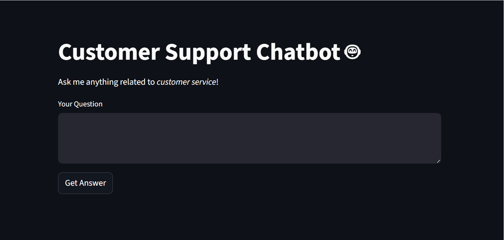
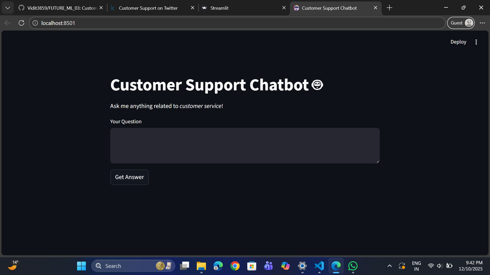
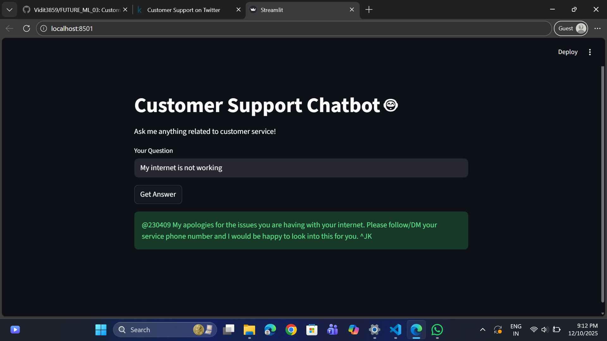
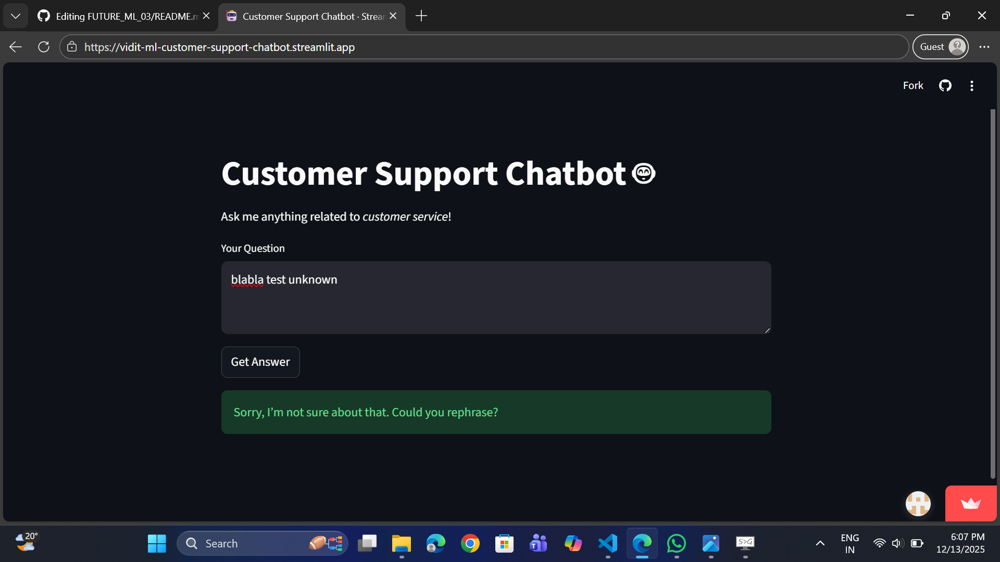

# 🤖 Customer Support Chatbot (NLP + ML)

A Machine Learning–powered **Customer Support Chatbot** that automatically responds to customer queries using **Natural Language Processing (NLP)** and **Information Retrieval** techniques.

The chatbot is trained on historical customer–agent conversations and uses **TF-IDF vectorization + cosine similarity** to find the most relevant response.  
It is deployed as an interactive **Streamlit web application**.

🔗 **Live Demo:**  
https://vidit-ml-customer-support-chatbot.streamlit.app/

---

## 📖 Project Overview

Customer support teams often handle a large number of repetitive queries such as password resets, refunds, delivery status, and contact information. This project aims to **automate first-level customer support** by providing instant, accurate responses using Machine Learning.

This chatbot works as an **information-retrieval system**, not a generative model.  
It matches user questions with the most similar previously answered customer queries and returns the corresponding response.

### 🔍 How it works
- User enters a query through the Streamlit web interface
- The text is cleaned and preprocessed
- TF-IDF vectorization converts text into numerical form
- Cosine similarity finds the closest matching FAQ
- The best response is returned, or a fallback message if confidence is low

### 🎯 Use Cases
- Automated FAQ support
- First-level customer service automation
- NLP portfolio project demonstrating real-world ML usage

---

## 🎯 Project Objectives

- Build an end-to-end NLP pipeline  
- Clean and preprocess real-world noisy text data  
- Train a vector-based retrieval model  
- Develop a modular chatbot engine  
- Deploy as a fully interactive web app using *Streamlit*

---

## 🧠 Key Features

### ✅ Smart Text Preprocessing  
Removes URLs, usernames, special characters, and normalizes text for uniform processing.

### ✅ TF-IDF + Cosine Similarity Engine  
Finds the closest answer from 1.2M+ cleaned Q&A pairs.

### ✅ Fallback Response  
When similarity is too low, the chatbot returns a polite fallback message instead of giving incorrect answers.

### ✅ Streamlit UI  
A clean, modern interface where users can ask any customer support–related question.

---

## 🛠 Tech Stack

The project is built using the following technologies and tools:

### 💻 Programming Language
- **Python**

### 📊 Data Processing & Machine Learning
- **Pandas** – data handling and preprocessing  
- **NumPy** – numerical operations  
- **scikit-learn** – TF-IDF vectorization and cosine similarity  

### 🧠 Natural Language Processing
- **TF-IDF (Term Frequency–Inverse Document Frequency)**  
- **Cosine Similarity** for semantic matching  

### 🌐 Web Application
- **Streamlit** – interactive web interface for the chatbot  

### 📦 Model Persistence
- **Joblib** – saving and loading trained models efficiently  

### 🧪 Development Tools
- **Jupyter Notebook** – EDA and model experimentation  
- **VS Code** – development environment  
- **Git & GitHub** – version control and collaboration  

### ☁ Deployment
- **Streamlit Cloud** – hosting and deployment of the web app

---

## 📊 Dataset Description

This project uses the **Twitter Customer Support Dataset (TWCS)**, which contains real-world conversations between customers and customer support agents on Twitter.

The dataset includes:
- Customer questions or complaints
- Official responses from company support accounts
- Conversation metadata (tweet IDs, reply relationships, timestamps)

### 🧹 Data Processing
Due to the large size of the original dataset, only a **small, relevant subset** is used in the final application.

The following steps were performed:
- Removal of URLs, mentions, special characters, and extra spaces
- Conversion of text to lowercase
- Extraction of meaningful **question–answer pairs**
- Removal of duplicate entries
- Selection of a compact FAQ-style dataset for fast inference

### 📁 Stored Data
Instead of storing the full raw dataset in the repository, the processed data is saved as a lightweight artifact:

- `faq_data.pkl` → cleaned FAQ dataframe  
- `vectorizer.pkl` → trained TF-IDF vectorizer  

This keeps the repository clean, lightweight, and deployment-friendly.

> ⚠ **Note:**  
> The original raw dataset is intentionally excluded from the repository due to its large size.

---

## 📂 Project Structure

```.md
FUTURE_ML_03/
├─ app/
│  └─ app.py
├─ assets/
│  ├─ Chatbot_Homepage.png
│  ├─ Question+Answer.png
│  └─ Fallback_Example.png
├─ data/
│  ├─ raw/
│  └─ processed/
├─ models/
│  ├─ faq_data.pkl
│  └─ vectorizer.pkl
├─ notebooks/
│  ├─ 01_eda.ipynb
│  └─ 02_model.ipynb
├─ utils/
│  ├─ chatbot_engine.py
│  └─ text_cleaning.py
├─ requirements.txt
├─ README.md
└─ .gitignore
```

---

## 🏗 System Architecture


          ┌────────────────────┐
          │   User Query       │
          └─────────┬──────────┘
                    │
                    ▼
        ┌────────────────────────┐
        │ Text Cleaning Pipeline │
        └─────────┬──────────────┘
                  │
                  ▼
      ┌──────────────────────┐
      │   TF-IDF Vectorizer  │
      └──────────┬───────────┘
                 │
                 ▼
     ┌────────────────────────┐
     │ Cosine Similarity Match│
     └──────────┬─────────────┘
                │ Best Match
                ▼
      ┌────────────────────────┐
      │  Retrieve Agent Reply  │
      └────────────────────────┘

     (If similarity < threshold → fallback message)


---

## 🎬 Project Demo (GIF)

Below is a short demo showcasing the Customer Support Chatbot in action, including:
- Asking a known customer query
- Receiving an automated response
- Triggering the fallback response for unknown queries

<p align="center">
  
</p>

---


## ⚙ Installation & Setup

### 1️⃣ Clone the Repo

```bash
git clone https://github.com/Vidit3859/FUTURE_ML_03
cd FUTURE_ML_03
```

### 2️⃣ Create a virtual environment

```bash
python -m venv venv
```

Activate it:

**Windows (PowerShell/CMD)**

```bash
venv\Scripts\activate
```

**macOS/Linux**

```bash
source venv/bin/activate
```

### 3️⃣ Install dependencies

```bash
pip install -r requirements.txt
```

### 4️⃣ Run the app

```bash
streamlit run app/app.py
```

Your chatbot will open at:

👉 http://localhost:8501

### ✅ Prerequisites

- Python 3.9+

- Git

- Internet connection (for initial package installation)

---

## 📸 Screenshots

### 🏠 Chatbot Homepage
The main interface of the Customer Support Chatbot built using Streamlit.



---

### 💬 Question & Answer Example
An example showing how the chatbot retrieves the most relevant answer for a user query using TF-IDF and cosine similarity.



---

### 🔄 Fallback Response Example
When the similarity score is below the defined threshold, the chatbot safely returns a fallback response.



---

## 📊 Model Details

### 🔹 TF-IDF Vectorizer  
Transforms text into numerical weights.

### 🔹 Cosine Similarity  
Computes how similar the user query is to all historical questions.

### 🔹 Fallback Handling  
If similarity < **0.2**, the model responds:  
> “I'm not sure about that. Could you rephrase?”

---

## 🚀 Future Improvements

- Integrate deep learning model (Sentence Transformers / BERT)
- Add multi-turn conversation memory  
- Deploy on cloud (Render / HuggingFace / Streamlit Cloud)  
- Add voice-based input  

---

## 👨‍💻 Author

**Vidit Kumar**

- 📧 Email: vidit.kumar624@gmail.com
- 🔗 LinkedIn: https://linkedin.com/in/viditkumar-in  
- 🐙 GitHub: https://github.com/Vidit3859  

---

## ⭐ Support

If you like this project, please ⭐ the repository!  
Your support motivates further development ❤

---
